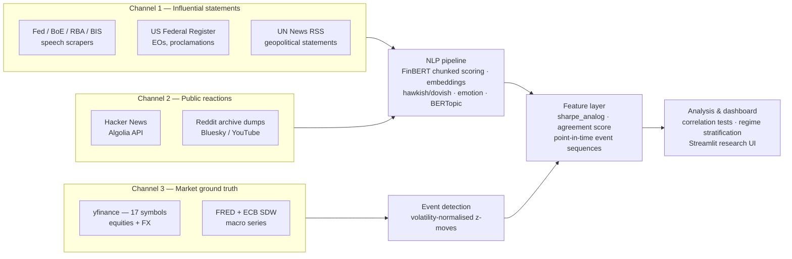

# Sentiment Signal

**A three-channel NLP + time-series research system that captures influential statements, public reactions, and market ground truth — and measures how they relate.**

Built as the empirical platform for a master's thesis in financial NLP. The research questions:

1. **Descriptive:** Is *public opinion* — crowd reactions to influential statements, and statement↔reaction dynamics — associated with what actually happens in markets? This is a correlational study with strict point-in-time discipline, **not** a trading model.
2. **Ablation:** Does this sentiment data, curated by an interpreter model, improve the directional accuracy of an independent S&P 500 LSTM forecaster? (A feature-contribution ablation against a baseline ladder.)

> Python 3.11+ · PostgreSQL + pgvector · PyTorch / HuggingFace Transformers · FastAPI · Streamlit · MIT licensed

---

## Architecture

Three independent data channels converge into a feature layer and an analysis/dashboard layer:



All collected text and scores live in PostgreSQL (pgvector for 768-d embeddings, HNSW-indexed); every pipeline stage is resumable and idempotent (content-hash dedup, model-version-aware re-scoring).

### The novel feature: `sharpe_analog`

For each statement, the crowd's reaction is summarised as
`engagement_weighted_delta / reaction_std` — a Sharpe-ratio-like quantity over reaction sentiment: how strongly the crowd's sentiment shifted relative to the statement, normalised by how much the crowd *disagreed with itself*. A strong consensus shift scores high; a loud-but-divided reaction scores low. Complemented by an `agreement_score` (cosine similarity between statement and reaction embeddings).

## What's interesting in here

- **Long-document scoring done right** — transformer sentiment models truncate at 512 tokens, but the median central-bank speech is ~19k characters, so a naive pass scores only the greeting. `NLPPipeline.analyze_documents()` chunks each document into 512-token windows, scores and embeds every chunk, and aggregates with a token-count-weighted mean.
- **Point-in-time discipline** — `features/sequence.py` provides an `events_asof(t)` primitive (strictly-before-`t`, with explicit no-future-leak tests) so downstream models can never see the future. Curated macro regimes (`context_periods`) are deliberately kept as *analytical* stratification, not model features, to avoid hindsight bias.
- **Volatility-normalised event detection** — market events are measured in standard deviations of each market's own daily-return distribution (`magnitude_z`), so a 1% move in the Hang Seng and a 1% move in the FTSE aren't treated as the same thing.
- **Domain-aware NLP routing** — hawkish/dovish scoring (lexicon with additive smoothing, plus FOMC-RoBERTa) applies only to central-bank speeches; financial sentiment is not applied to ceremonial text; BERTopic (chunked sentence-transformer embeddings + c-TF-IDF) provides per-document topic labels with a curated two-level taxonomy on top.
- **Hardened scraping** — every collector extends a `BaseScraper` contract: per-run audit records, SHA-256 content-hash dedup, error isolation (a scraper never raises), text sanitisation for PostgreSQL, exponential backoff, and honest heartbeat progress logging.
- **Tested where it matters** — 100+ tests; pure-function tests for the thesis-critical math run without a database, DB-backed tests use a real Postgres test instance and skip cleanly when it's absent. The test suite has caught real silent-corruption bugs (floating-point guards, person-resolution collisions, int32 volume overflow).

## Data sources

| Channel | Source | Collector |
|---|---|---|
| Statements | Federal Reserve speech archive (2015–) | `collectors/fed_speeches.py` |
| Statements | Reserve Bank of Australia | `collectors/rba_speeches.py` |
| Statements | Bank of England (RSS) | `collectors/boe_speeches.py` |
| Statements | BIS central bankers' speeches (~60 banks, English) | `collectors/bis_speeches.py` |
| Statements | US Federal Register — executive orders, proclamations | `collectors/federal_register.py` |
| Statements | UN News (peace & security, regional feeds) | `collectors/un_sg_speeches.py` |
| Reactions | Hacker News (Algolia search API, keyless, full history) | `collectors/hn_reactions.py` |
| Reactions | Reddit archive dumps (Arctic Shift / Pushshift `.zst`) | `collectors/reddit_dump.py` |
| Reactions | Bluesky (AT Protocol), YouTube Data API, Reddit live | `collectors/{bluesky,youtube,reddit}_reactions.py` |
| Markets | yfinance — 17 symbols (US/EU/Asia indices, major FX) | `scripts/run_phase1.py` |
| Macro | FRED (25 series) + ECB Statistical Data Warehouse | `scripts/run_phase1.py` |

Current corpus: ~5,000 scored statements from ~145 public figures, ~12,000 market events, ~49,000 price rows, ~27,000 macro observations (2015–2026).

## NLP models

| Model | Role |
|---|---|
| `ProsusAI/finbert` | Financial sentiment (chunked, token-weighted aggregation) |
| `gtfintechlab/FOMC-RoBERTa` | Hawkish/dovish stance on central-bank speeches (with a rule-based lexicon as transparent baseline) |
| `j-hartmann/emotion-english-distilroberta-base` | Emotion vectors |
| `cardiffnlp/twitter-roberta-base-sentiment` | General/social sentiment lens |
| Sentence-transformers + BERTopic | Topic modelling (67 coherent topics, two-level taxonomy) |

Models run float16 on GPU (CUDA/MPS) and float32 on CPU. Inference is cached by `model_version`, so corpus re-scoring happens only when the scoring method changes.

## Quick start

```bash
git clone https://github.com/N041M/sentiment-signal.git && cd sentiment-signal
cp .env.example .env
python3 -m venv .venv && source .venv/bin/activate
pip install -e ".[dev]"
docker compose up -d
```

`.env` works empty for a first run; API keys (FRED, HuggingFace, Bluesky, YouTube…) unlock more sources — see `.env.example`. Docker brings up PostgreSQL 17 + pgvector with the schema auto-applied (`db/schema.sql`); a local Postgres works too (`psql $DATABASE_URL < db/schema.sql`, then the migrations in `db/migrations/`).

```bash
python scripts/run_phase1.py                 # full pipeline: seed → scrape → score → events
python scripts/run_phase1.py --steps 1,2     # or individual steps
python scripts/cluster_speeches.py           # BERTopic topic modelling
streamlit run sentiment_signal/dashboard/app.py   # research dashboard
uvicorn sentiment_signal.api.main:app --reload    # REST API
make check                                   # ruff + pytest
```

## Project layout

```
sentiment_signal/
  config.py          # pydantic-settings; single settings object
  db/                # SQLAlchemy ORM (15 models), session management
  collectors/        # per-source scrapers on a shared BaseScraper /
                     # BaseReactionScraper contract
  nlp/               # NLPPipeline (chunked scoring/embedding), hawkish
                     # lexicon, topic lexicon, BERTopic topic model
  features/          # sharpe_analog, point-in-time sequences, novelty,
                     # macro-context overlay, market-relevance geography
  models/            # SentimentLSTM (dual-head) + CombinedLoss
  api/main.py        # FastAPI endpoints
  dashboard/app.py   # Streamlit research dashboard (6 tabs)
  scheduler/jobs.py  # APScheduler job definitions (12 jobs)
db/schema.sql        # canonical SQL schema + migrations/
scripts/             # pipeline steps, seeds, analysis scripts
tests/               # pure-function + DB-backed test suites
```

The Streamlit dashboard includes sentiment-over-time with macro-regime overlays, interactive topic-cluster maps with drill-down colouring, event correlation scatters, and an ad-hoc scoring tab.

## Research status

- **Phase 1 (complete):** historical statement corpus scraped, scored, and topic-modelled; market and macro data loaded; volatility-normalised event detection; correlation framework with day-clustered significance testing and regime stratification.
- **Phase 2 (in progress):** the public-reaction channel (first live reactions captured), reaction-sentiment scoring, populating `sharpe_analog`, and the LSTM baseline-ladder ablation.

Detailed empirical results, including pre-registered-style negative results, are reserved for the thesis; the methodology is fully reproducible from this repository.

## Citations

This project builds on, and any derived work must cite where indicated:

- **FOMC-RoBERTa** (non-commercial license; citation required): Shah, Paturi & Chava, [*Trillion Dollar Words: A New Financial Dataset, Task & Market Analysis*](https://aclanthology.org/2023.acl-long.368/), ACL 2023.
- **FinBERT**: Araci, [*FinBERT: Financial Sentiment Analysis with Pre-trained Language Models*](https://arxiv.org/abs/1908.10063), 2019.
- **Financial PhraseBank**: Malo et al., [*Good Debt or Bad Debt: Detecting Semantic Orientations in Economic Texts*](https://arxiv.org/abs/1307.5336), JASIST 2014.
- **BERTopic**: Grootendorst, [*BERTopic: Neural topic modeling with a class-based TF-IDF procedure*](https://arxiv.org/abs/2203.05794), 2022.

## License

[MIT](LICENSE) — © 2026 Ronald Karel Grant. Note that some upstream models (FOMC-RoBERTa) carry non-commercial licenses independent of this code.
